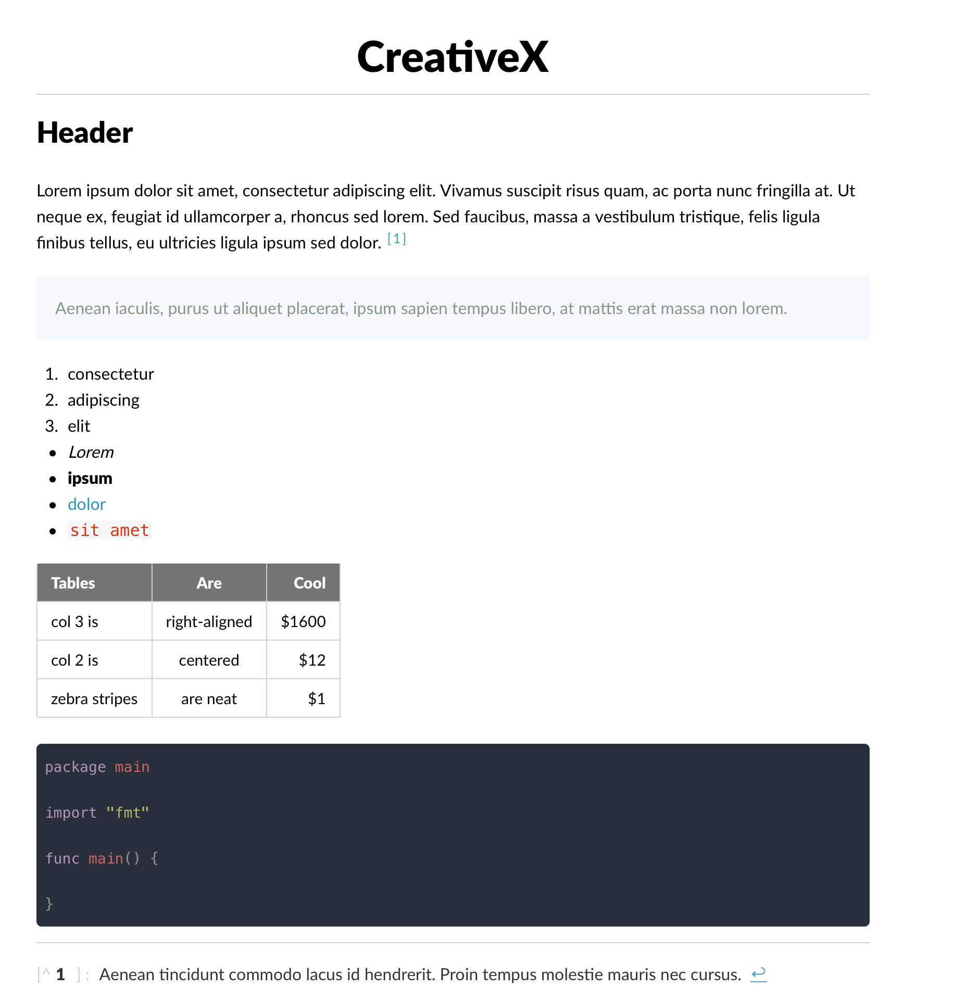

<h1 align="center">Creativex</h1>

<p align="center">
An amazing theme for <a href="https://typora.io/">typora</a>, inspired by <a href="https://github.com/BoostIO/Boostnote">Boostnote</a>.
</p>

---

## Preview



## Installation

### Mac

```bash
git clone https://github.com/RayYH/typora-creativex-theme && cd typora-creativex-theme
source bootstrap.sh
```

### Other platform

1. Open Theme Folder from `Preference Panel` → `Appearance` section.
2. Copy `creativex.css` and `creativex` folder, into the newly opened folder.
3. Restart typora, then select it from `Themes` menu.

## LICENSE

This project is licensed under [MIT](LICENSE) license.
